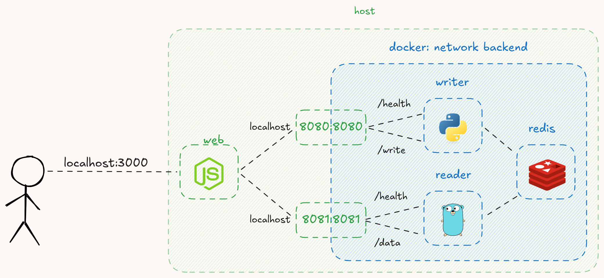

# Desafio DevOps jr PicPay

## Como rodar

~~~bash
docker compose up
~~~

## Desenho

---

## Conteúdo do repositório
Na pasta `services` deste repositório existem 3 aplicações, um frontend que se comunica com um backend go e um em python, e estes se comunicam com um Redis para troca de informações. Tudo isso é orquestrado pelo docker-compose na raiz do repositório.

As aplicações contém falhas propositais, de código, projeto, imagem docker, etc. Embora cada aplicação funcione individualmente, o conjunto não sobe...

## O que deve ser feito?

Faça um fork deste repositório e envie uma pull request contendo:
- ajustes que fazem todas as aplicações subirem e se comunicarem
- um README contendo os seus pensamentos ao longo do projeto
- um desenho contendo os serviços que explique o funcionamento
